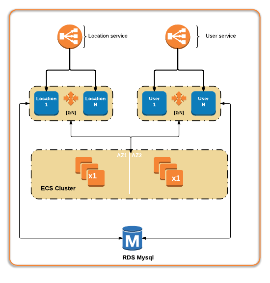

## Introduction

In this article we will look at AWS ECS (Elastic Container Service) and how it could be used to deploy Docker containers. ECS is a cluster management framework that provides

 - Management of EC2(Elastic Compute) instances that run as Docker Hosts. 
 
 - Scheduler to execute processes/containers on EC2 instances.
 
 - Constructs to deploy and manage versions of the applications.
 
 - You can also combine this with AWS Autoscale groups and ELB(Elastic Load Balancing) service.


## ECS Use cases

 - Build a production scale, auto-scaling and monitored platform for running Docker containers.

 - Quickly deploy pre-built containers; E.g a Wordpress Blog. 

 - If you are already using AWS, outside of cost for EC2 instances, there is no additional cost for ECS. So it is a low friction entry point for testing and proof of concepts.


## ECS Concepts
 
Here are some of the core ECS concepts:

 - Cluster :  A logical grouping of EC2 container instances. The cluster is a skeleton around which build your workload.
 
 - Container Instance/s : This is actually an EC2 instance that runs the ECS agent. The recommended option is to use AWS ECS AMI but any AMI can be used as long as you bootstrap the ECS agent to it. The ECS agent is open source as well.
 
 - Task Definition : An application containing one or more containers. This is where you provide the Docker images, how much CPU/Memory to use, ports etc. You can also link containers here similar to Docker command line. Tasks are somewhat similar to Docker Compose.

 - Task : An instance of a task definition running on a container instance.
 
 - Service : A service in ECS allows you to run and maintain a specified number of instances of a task definition. If a task in a service stops, the task is restarted. Services ensure that desired number of running tasks are achieved and maintained. Services  can also include other constructs like an Elastic Load Balancer(ELB) or Identity and Access Management (IAM) roles.

 - Container : A Docker container that is run as part of a task.

 
## ECS Considerations & Limitations


 - AWS recommends using their EC2 AMIs for the EC2 instances. If you want more control over this or want run CoreOS or similar, then you need to bake ECS agents into those AMIs. The ECS agent is open source and so you can easily do that.

 - Autoscale is a perfect use-case for this type of workloads and so build the EC2 instances using an Autoscale policy.
 
 - AWS Cloudwatch has decent monitoring for ECS and can be leveraged for general needs. For something more dynamic, you will need to look at external tools like Datadog.

 - Service discovery is limited inside ECS. You can use environment variables in task definitions but that is not service discovery per say. You can run something like Consul or Weave and use it for service discovery. AWS has a good blog article on this ; [https://aws.amazon.com/blogs/compute/service-discovery-via-consul-with-amazon-ecs/]()

 - Use ECS schedulers for auto-recovery of services. ECS has few in-built options and also allows external schedulers. So you can use something like Mesos with ECS; [https://github.com/awslabs/ecs-mesos-scheduler-driver]() 
 
 - As of the writing of this article, it is not available in all regions. This applies to both ECS and ECR (Elastic Container Registry). You can check the status of the regional services [here](https://aws.amazon.com/about-aws/global-infrastructure/regional-product-services/)
 
 - There is no central Docker endpoint as far as the ECS cluster is concerned. As a developer, you cannot point your local Docker client to an ECS endpoint. Note, while some may see this as a limitation, the purpose of ECS is not to provide a Docker endpoint. ECS purpose is targeted at running Docker instances from an Operations perspective. 
 
 - You are still running a container inside a virtual machine and Bare-metal performance is always the best option for containers. However, AWS has started providing ways to control the underlying hardware which can help with this. Eg. Controlling the C-states; [http://docs.aws.amazon.com/AWSEC2/latest/UserGuide/processor_state_control.html]()
 
 - You are limited to one port per task definition. When creating a task, you can omit the "Host port" option and a port will automatically be chosen when it is started. However, when registering tasks behind ELBs, ELB currently requires that all EC2 instances have the same port registered (which is the ECS host port). This may get fixed in future releases and is actively discussed in the [forums](https://forums.aws.amazon.com/message.jspa?messageID=665031). If you need to lots of containers mapped to the same port numbers, you will need more EC2 instances. Using many smaller instance size will also help with this situation. 
 

## ECS Step by Step

### Goals 

Note, this assumes some familiarity with Git & Docker and AWS services like VPC, ELB, EC2. The goal of this tutorial is to achieve the following

 - Deploy two services into ECS, behind separate Elastic Load balancers
 
 - Deploy them using ECS cli and using the tasks and services
 
 - Perform a change to the application and deploy new versions
 
 - Review how ELB works with these changes
  
Here's how it looks architecturally 



And here's the flow:


### Get ECS running

Now let's create the services we need to get started.
 
 - Follow the AWS guide to get the necessary IAM roles etc in place for ECS [Setting Up with Amazon ECS](http://docs.aws.amazon.com/AmazonECS/latest/developerguide/get-set-up-for-amazon-ecs.html)
 
  - Create a ECS cluster by going to the [Amazon ECS console](https://console.aws.amazon.com/ecs/) and selecting "Create Cluster".
 
 - In the cluster name field, enter a name for your cluster and create it. We used '*app01*' in this example but if you don't choose anything it uses 'default'
 
 - This only creates a framework for ECS. Now we add EC2 instances to it. The best way to do this is via an Autoscaling group. So create an autoscale group launch configuration and use the 'amzn-ami-2015.09.g-amazon-ecs-optimized' AMI
 
 - For this example, t2.medium was used but you can use micro instances as well. 

 - In the IAM section provide the corresponding ECS role created when preparing the account.
 
 - If you have changed the cluster name, then you need to add User data to the launch configuration. If you build your own ECS AMIs, you can bake this into the AMI.
 
```
 #!/bin/bash
echo ECS_CLUSTER=app01 >> /etc/ecs/ecs.config
```

 - Once the launch configuration is complete, in the Autoscale section, select 4 instances and give it a group name.
 
 - Then provide the ECS VPC and subnets for Autoscale.
 
 - Since this is a demo, we can keep the group at initial size. 
  
 - Review and launch this. Then wait for a few minutes as the EC2 instances are spun up and start appearing under the ECS Instances section of your ECS cluster.
 
 
### Get ELB running

 - For this example create two ELB instances; location and user Creation of the ELB is the same as any ELB creation.
 
   - You have decide on the ports you will use for the services. In our example, we choose port 8081 for the location service and 9091 for the user service.
   
   - Configure proper health checks as you would with any instance.
   
   - Do not add any EC2 instances to it. This will be done later on in the ECS service side.


### Get RDS running

 - You can skip this step but to make this more real world, we created a RDS instance that the containers will use for databases.
 
 - Create an RDS DB of your choice and configure per normal.
 
 - Note down the credentials and endpoints for later use.


### Check the setup

At this point your setup should look like this.

```
aws ecs list-clusters
{
    "clusterArns": [
        "arn:aws:ecs:us-east-1:xxxxxxxxxxxxxxxx:cluster/app01"
    ]
}
```

```
aws ecs describe-clusters --cluster app01
{
    "clusters": [
        {
            "status": "ACTIVE", 
            "clusterName": "app01", 
            "registeredContainerInstancesCount": 4, 
            "pendingTasksCount": 0, 
            "runningTasksCount": 0, 
            "activeServicesCount": 0, 
            "clusterArn": "arn:aws:ecs:us-east-1:xxxxxxxxxxxxxxxx:cluster/app01"
        }
    ], 
    "failures": []
}
```

```
aws ecs list-container-instances --cluster app01
{
    "containerInstanceArns": [
        "arn:aws:ecs:us-east-1:xxxxxxxxxxxxxxxx:container-instance/0d9c2658-d9ca-432d-a1e7-5f74682c96f0", 
        "arn:aws:ecs:us-east-1:xxxxxxxxxxxxxxxx:container-instance/43e45208-b1ce-4ca4-96e9-62492f1540c4", 
        "arn:aws:ecs:us-east-1:xxxxxxxxxxxxxxxx:container-instance/c120903d-3165-434d-afe0-36b43d909ec1", 
        "arn:aws:ecs:us-east-1:xxxxxxxxxxxxxxxx:container-instance/ec49b768-c04e-439c-9264-2ca670589177"
    ]
}
```

Also make sure ELB and RDS instances are up and running.


### Docker Images

 - This can be any Docker images, but for this example, we built a Docker image which runs Ubuntu, Nginx, PHP-fpm. We added some custom code to connect to RDS etc. All the source is available [https://github.com/srirajan/ecs-playground](https://github.com/srirajan/ecs-playground)
 
 - Build the docker images and upload them to your Docker hub. This example uses public images but you can also embed Docker Hub credentials and use private images.
 
```
git clone https://github.com/srirajan/ecs-playground
cd ecs-playground
cd docker 
cd location
docker build -t="srirajan/location" .
docker push "srirajan/location"
cd ..
cd user
docker build -t="srirajan/user" .
docker push "srirajan/user"
```
 

### Deploying tasks and services

 - Once we have the images, lets start deploying. The first step is to create a task definition. Here's an task file that we used.

```
{
  "containerDefinitions": [
    {
      "name": "location",
      "image": "srirajan/location:10",
      "cpu": 512,
      "memory": 1024,
      "essential": true,
      "portMappings": [
        {
          "containerPort": 8081,
          "hostPort": 8081
        }
      ],
      "environment": [
        { "name": "DB_HOST", "value": "ecsdb.cat6z5up2jds.us-east-1.rds.amazonaws.com" },
        { "name": "DB_USER", "value": "location" },
        { "name": "DB_PWD", "value": "RDS_PWD" },
        { "name": "DB_NAME", "value": "location" }
      ],
      "extraHosts": [
      {
        "hostname": "googledns",
        "ipAddress": "8.8.8.8"
      }
    ]
    }
  ],
  "family": "location"
}
```

Parameters explained :

name - is the container name.

family - Name of the task definition. It is not clear when this would be different from name.

image - is the public image on DockerHub.

cpu - is the number of cpu units to allocate (there are 1024 units per CPU core).

memory - is the amount of memory to allocate in MB. Note, if you process consumes more than this, it is killed. So this may require some testing to get it right. It is also a good guardrail to contain process. For e.g. if this belongs to a dev role, you can restrict it's usage.

portMappings - The one to one mapping for the EC2 host port and the container port. This can be an array and so you have more than one. If you leave the host port as 0, ECS will automatically select a host port. In our example this is the same as the port configured on the ELB side

environment - It is the same as passing Docker environment variables using -e

extraHosts - Just an example where ECS allows you to inject arbitrary host file entries in /etc/hosts

You can read about the parameters in detail here [http://docs.aws.amazon.com/AmazonECS/latest/developerguide/task_definition_parameters.html](http://docs.aws.amazon.com/AmazonECS/latest/developerguide/task_definition_parameters.html)

 - Set the region as it helps with the cli
 
```
export AWS_DEFAULT_REGION=us-east-1
```

 - Register the task definition. This does not instantiate the task, so, nothing is running right now.

```
aws ecs register-task-definition --cli-input-json file://location.json
```

 - Update the Security groups associated with the ECS EC2 instances to allow the ports above. The ELB needs access to those ports.
 
 - Now create the service definition using the following definition file
 
```
{
    "cluster": "app01",
    "serviceName": "location",
    "taskDefinition": "location",
    "loadBalancers": [
        {
            "loadBalancerName": "location",
            "containerName": "location",
            "containerPort": 8081
        }
    ],
    "desiredCount": 4,
    "clientToken": "lololololo",
    "role": "arn:aws:iam::xxxxxxxxxxxxxxxx:role/ecsServiceRole",
    "deploymentConfiguration": {
        "maximumPercent": 200,
        "minimumHealthyPercent": 50
    }
}
```

```
aws ecs create-service --cli-input-json file://location.json
```

- You can check the status via command line.

```
aws ecs describe-services --services location --cluster app01
```

 - If all is working you will see a "runningCount" of 4 and the corresponding load balancer is now serving traffic.


 - Repeat the same for the User.

 - User task.

```
{
  "containerDefinitions": [
    {
      "name": "user",
      "image": "srirajan/user:1",
      "cpu": 512,
      "memory": 1024,
      "essential": true,
      "portMappings": [
        {
          "containerPort": 9091,
          "hostPort": 9091
        }
      ],
      "environment": [
        { "name": "DB_HOST", "value": "ecsdb.cat6z9dp2jds.us-east-1.rds.amazonaws.com" },
        { "name": "DB_USER", "value": "user" },
        { "name": "DB_PWD", "value": "RDS_PWD" },
        { "name": "DB_NAME", "value": "user" }
      ],
      "extraHosts": [
      {
        "hostname": "googledns",
        "ipAddress": "8.8.8.8"
      }
    ]
    }
  ],
  "family": "user"
}
```

```
aws ecs register-task-definition --cli-input-json file://user.json
```


 - User Service.
 
```
{
    "cluster": "app01",
    "serviceName": "user",
    "taskDefinition": "user",
    "loadBalancers": [
        {
            "loadBalancerName": "user",
            "containerName": "user",
            "containerPort": 9091
        }
    ],
    "desiredCount": 4,
    "clientToken": "usususus",
    "role": "arn:aws:iam::xxxxxxxxxxxxxxxx:role/ecsServiceRole",
    "deploymentConfiguration": {
        "maximumPercent": 200,
        "minimumHealthyPercent": 50
    }
}
```

```
aws ecs create-service --cli-input-json file://user.json
```

```
aws ecs describe-services --services user --cluster app01
```


 - At this point we have two services each running 4 docker containers on top of 4 EC2 instances. You can look at the ELB setup and you will now see instances in service.  The ECS console will also show them as active. 

 - Now if we decide to change the application, you will make the changes to the docker image and push it back to Docker hub, under a new tag (version)
 
 - Then you need to update the json file for the task definition with the new tag. The only thing that changes in the json file is the image link. If you don't use tags and rely on the latest docker image, then no change is needed to the json file.

 - Update the task definition to a new version. In this example, location task definition has changed to version 11
 
```
aws ecs register-task-definition --cli-input-json file://user.json
```

 - Then we update the service to use the new version. In an update scenario, minimumHealthyPercent plays an important part. This ensures, the upgrade is rolled out in a rolling fashion and the number of running tasks never falls below the minimumHealthyPercent.
 
```
aws ecs update-service --cluster default --service location --desired-count 4 --task-definition location:11 --deployment-configuration maximumPercent=200,minimumHealthyPercent=50
```

## Conclusion

That's ends this tutorial and hope it was useful. Overall, ECS provides an excellent platform in the AWS ecosystem to run Docker containers.
 

## References and Links

 - [http://docs.aws.amazon.com/cli/latest/reference/ecs/]()
 
 - [http://docs.aws.amazon.com/AWSEC2/latest/UserGuide/processor_state_control.html]()

 - [https://github.com/awslabs/service-discovery-ecs-consul/blob/master/service-discovery-blog-template]()
  

## About the author

Sriram (Sri) Rajan is a Principal Architect at Rackspace and responsible for designing and architecting cloud based solutions for customers. Sri has more than fifteen years of professional experience working with computer systems, networks, programming and security. Prior to joining Rackspace, Sri worked as a systems programmer at Texas State University in San Marcos, from where he also earned his masters degree in computer science. He studied and lived in the United States for a total of nine years before relocating to the UK in 2010. You connect with him on social media at in/rajansriram and @sriramrajan
